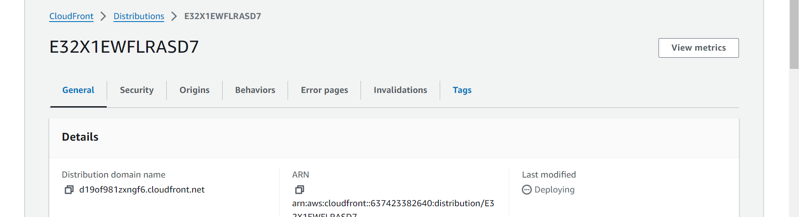

**Hosting a Static Website using AWS S3 and CloudFront as the CDN**

A static website comprises plain HTML files, CSS stylesheets, images, and Javascript files. Unlike dynamic websites, static websites do not rely on server-side processing, making them faster and easier to host. These websites are best suited for businesses or individuals who require a simple online presence without the need for complex functionality. In contrast to dynamic websites, static websites are less likely to require updates or maintenance, making them a cost-effective solution for businesses and organizations that do not need to frequently update their online content.

**Amazon S3**

Amazon S3 is a highly reliable and scalable Object Storage service designed to cater to all your file storage requirements. It offers virtually limitless storage capacity, allowing you to store and access your data effortlessly.

**Amazon CloudFront** 

This a highly efficient Content Delivery Network (CDN) service that offers global coverage, enabling quick and low-latency file and data caching and serving to users around the world. It is a reliable and scalable solution that can be leveraged to improve user experience by accelerating content delivery while reducing latency.

**Requirements for this project**
1. AWS account
1. Your static website

**STEP 1: Creating the S3 bucket**

1. After logging into your AWS Console, under Services > All Services, search for “S3” and click on it to go to the S3 dashboard.

1. On the S3 Dashboard, click on the Create Bucket button to create a new storage bucket to store your static website files and enter a bucket name. The name has to be globally unique, so retry with another name if you get an error “Bucket with the same name already exists”.

1. Since we want to allow anyone to view our website, untick the checkbox for Block all public access, and make sure to check the I acknowledge… statement checkbox below it and leave all other settings intact and click on the Create bucket button at the bottom of the page.

**Step 2 - Upload Website files to S3 Bucket**

1. After creating a new bucket, click on the bucket name to view the bucket details.

1) Once a new bucket is created, it will be always empty. You will now have to click on the Upload button to upload some files.

1. Leave all other settings intact, scroll to the bottom of the page and click on the Upload button to start the uploading of the files you have added above.

1. Depending on your network connection and the number of files, you will have to wait while the files are being uploaded to the S3 Bucket.

1. Once the uploading process has completed, you may check if each file has been uploaded successfully or if there are any errors. Otherwise, just click on the Close button to return to the Bucket details screen.
Here, mine is running just fine

**Step 3 - Enabling Static Website Hosting on S3 Bucket**

1. On the Bucket overview page, click on the Properties tab and scroll down.

1. Look for Static website hosting section and click on the Edit button.

1. Select Enable option for Static website hosting setting and you will be presented with more options as the following screenshot.

1. Scroll to the bottom of the page and click on the Save changes button.

Step 4 - Add a Bucket Policy
Before anyone could access the website on the bucket, we need to explicitly tell S3 Bucket to allow that.

1. On the Bucket overview page, click on the Permissions tab, scroll down and look for Bucket policy section.

1. On the Bucket policy section, click on the Edit button.

1. To grant public read access for your website on this bucket, create a bucket policy and click on the Save changes button when you are done.

1. You should now be able to access your website via the Amazon S3 Endpoint on the internet.

**ENDPOINT URL**

**ENDPOINT WEBSITE**

Return to the Bucket overview page

Click on the Properties tab

Scroll to the bottom and look for Static website hosting section

You can find the URL under Bucket website endpoint. Click on it to view your website.

**Step 5 - Creating a CloudFront Distribution**
1. From the top navigation under Services > All Services, search for “CloudFront” and click on it.

1. On the CloudFront Distributions page, click on the Create distribution button.

1. On the Create distribution page > under Origin section > for Origin domain > enter the Amazon S3 static website endpoint earlier, there will also be a dropdown button.

1. Leave other settings under Default cache behavior section to the default.

1. Enter “index.html” for Default root object. This file name must match with the index document file name entered in previously on S3.

1. Leave other settings intact. Scroll to the bottom and click on the Create distribution button.

1. As you remember from earlier, CloudFront will now distribute all your files to edge locations around the world. This process will take some time to complete.

1. Once Status has updated to Enabled, the distribution is ready to be accessed.

1. I can now access my website through the distribution domain name assignes to my cloudfront distribution 

